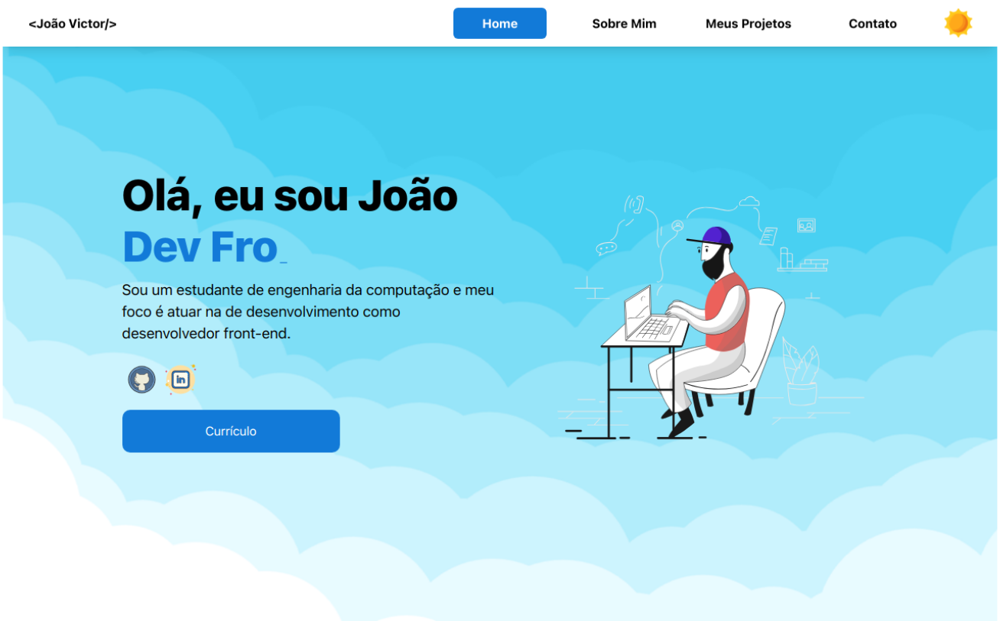

<h1 align='center'>Meu portifolio</h1>

Meu portfolio com apresentação de meus projetos pessoais e acadêmicos

## :page_facing_up: Funcionalidades

- ✔ Troca de temas (Light mode, Dark mode)
- ✔ Animações simples dinâmicas (Lib: Framer Motion)
- ✔ Envio de mensagens por Email
- ✔ Projeto responsivo

## :rocket: Tecnologias

As seguintes ferramentas foram utilizadas neste projeto:

- [React](https://react.dev/)
- [Framer Motion](https://www.framer.com/motion/)
- [Vite](https://vitejs.dev/)

## 🌐 Projeto no Ar:

https://joaoviictor.vercel.app/